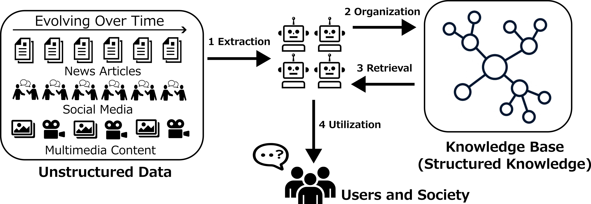

<!--  -->

[!NOTE]
This repository is currently under active development.
Major updates are planned soon, including changes to APIs, component interfaces, model loading, and datasets.
The current implementation should be considered unstable until the update is complete.

# KAPipe

**KAPipe** is a modular framework for building ***Knowledge Acquisition Systems*** from unstructured data.

KAPipe decomposes knowledge acquisition into four main stages:

1. **Extraction**: extracting knowledge units from unstructured data.
2. **Organization**: organizing extracted knowledge units into structured representations such as knowledge graph.
3. **Retrieval**: retrieving relevant knowledge for a given query or task.
4. **Utilization**: using retrieved structured knowledge for downstream tasks such as question answering.



KAPipe is used in the following papers:

- [Nishida et al., TACL 2026, **Dissecting GraphRAG: A Modular Analysis of Knowledge Structuring for Factoid Question Answering**.](https://aclanthology.org/2026.tacl-1.29/)
- [Oumaima and Nishida et al., BioNLP 2024, **Mention-Agnostic Information Extraction for Ontological Annotation of Biomedical Articles**.](https://aclanthology.org/2024.bionlp-1.37/)


## Installation

```bash
python -m pip install -U kapipe
```

For local development:

```bash
git clone https://github.com/norikinishida/kapipe.git
cd kapipe
python -m pip install -e .
```

Some pretrained models and configuration files are distributed separately.

```bash
mkdir -p ~/.kapipe
mv release.YYYYMMDD.tar.gz ~/.kapipe
cd ~/.kapipe
tar -zxvf release.YYYYMMDD.tar.gz
```

Release files are available here:

[KAPipe Release Files](https://drive.google.com/drive/folders/16ypMCoLYf5kDxglDD_NYoCNAfhTy4Qwp)

## Components

In KAPipe, a ***component*** is a modular processing unit that implements a specific approach within one of the four stages: extraction, organization, retrieval, or utilization.

The following table summarizes the components currently supported by KAPipe.

| Stage | Component | Module | Docs | Example |
|---|---|---|---|---|
| Extraction | Named Entity Recognition | `kapipe.ner` | [Docs](docs/components/ner.md) | [Example](experiments/ner) |
| Extraction | Entity Disambiguation (Retrieval) | `kapipe.ed_retrieval` | [Docs](docs/components/ed_retrieval.md) | [Example](experiments/ed_retrieval) |
| Extraction | Entity Disambiguation (Reranking) | `kapipe.ed_reranking` | [Docs](docs/components/ed_reranking.md) | [Example](experiments/ed_reranking) |
| Extraction | Document-level Relation Extraction | `kapipe.docre` | [Docs](docs/components/docre.md) | [Example](experiments/docre) |
| Organization | Entity Graph Construction | `kapipe.entity_graph_construction` | [Docs](docs/components/entity_graph_construction.md) | [Example](experiments/entity_graph_construction) |
| Organization | Community Clustering | `kapipe.community_clustering` | [Docs](docs/components/community_clustering.md) | [Example](experiments/community_clustering) |
| Organization | Report Generation | `kapipe.report_generation` | [Docs](docs/components/report_generation.md) | [Example](experiments/report_generation) |
| Organization | Chunking | `kapipe.chunking` | [Docs](docs/components/chunking.md) | [Example](experiments/chunking) |
| Retrieval | Passage Retrieval | `kapipe.passage_retrieval` | [Docs](docs/components/passage_retrieval.md) | [Example](experiments/passage_retrieval) |
| Utilization | Question Answering | `kapipe.qa` | [Docs](docs/components/qa.md) | [Example](experiments/qa) |

## Quickstart

TBA.

## Citation / Publication

If **KAPipe** is helpful for your work, please consider citing the following paper:

**Dissecting GraphRAG: A Modular Analysis of Knowledge Structuring for Factoid Question Answering**.
Noriki Nishida, Rumana Ferdous Munne, Shanshan Liu, Narumi Tokunaga, Yuki Yamagata, Fei Cheng, Kouji Kozaki, and Yuji Matsumoto.
Transactions of the Association for Computational Linguistics (TACL), vol. 14, pp. 627-655. 2026.
(Presented at ACL 2026)

```bibtex
@article{nishida-etal-2026-dissecting,
    title = "Dissecting {G}raph{RAG}: A Modular Analysis of Knowledge Structuring for Factoid Question Answering",
    author = "Nishida, Noriki  and
      Munne, Rumana Ferdous  and
      Liu, Shanshan  and
      Tokunaga, Narumi  and
      Yamagata, Yuki  and
      Cheng, Fei  and
      Kozaki, Kouji  and
      Matsumoto, Yuji",
    journal = "Transactions of the Association for Computational Linguistics",
    volume = "14",
    year = "2026",
    address = "Cambridge, MA",
    publisher = "MIT Press",
    url = "https://aclanthology.org/2026.tacl-1.29/",
    doi = "10.1162/tacl.a.615",
    pages = "627--655"
}
```

