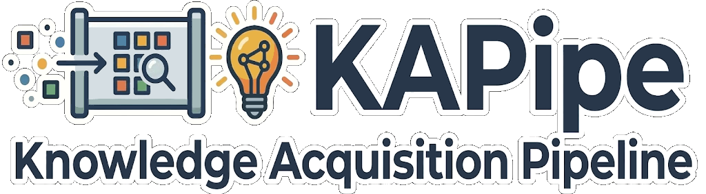
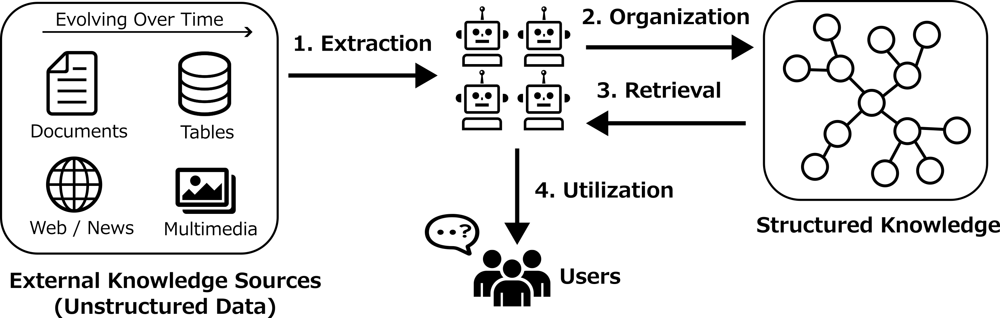
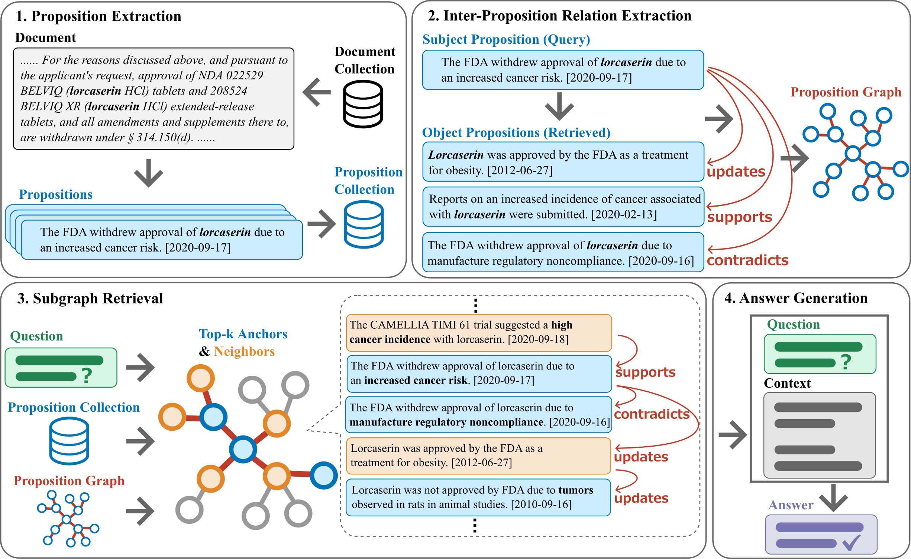
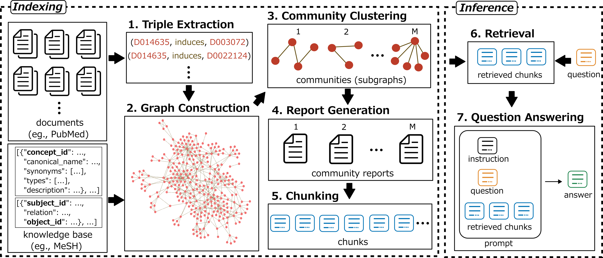

<!--  -->

# KAPipe



**KAPipe** is a modular framework for building knowledge acquisition systems from unstructured data.

In KAPipe, knowledge acquisition is organized into four stages:

1. **Extraction**: extracting knowledge units from unstructured data.
2. **Organization**: organizing extracted knowledge units into structured representations such as knowledge graph.
3. **Retrieval**: retrieving relevant knowledge for a given request.
4. **Utilization**: using retrieved knowledge to solve for downstream tasks such as question answering.

For each stage, KAPipe provides reusable *components* that implement specific approaches.
For example, KAPipe provides Document-level Relation Extraction and Proposition Extraction components for extraction, and Passage Retrieval and Graph Retrieval components for retrieval.
Together, these components serve as building blocks for constructing knowledge acquisition systems.

**Note:** KAPipe is designed for research and experimentation rather than production use. It is under active development and may introduce breaking changes without prior notice.

KAPipe is used in the following papers:

- Nishida et al., EMNLP 2026, **Beyond Retrieval: Structuring Evolving and Inconsistent External Knowledge with Proposition Relations for RAG**. (to appear)



- [Nishida et al., TACL 2026, **Dissecting GraphRAG: A Modular Analysis of Knowledge Structuring for Factoid Question Answering**.](https://aclanthology.org/2026.tacl-1.29/)



- [Oumaima and Nishida et al., BioNLP 2024, **Mention-Agnostic Information Extraction for Ontological Annotation of Biomedical Articles**.](https://aclanthology.org/2024.bionlp-1.37/)

## Installation

```bash
python -m pip install -U kapipe
```

For local development:

```bash
git clone https://github.com/norikinishida/kapipe.git
cd kapipe
python -m pip install -e .
```

## Components

In KAPipe, a ***component*** is a modular processing unit that implements a specific approach within one of the four stages: extraction, organization, retrieval, or utilization.

The following table summarizes the components currently supported by KAPipe.

| Stage | Component | Module | Docs | Example |
|---|---|---|---|---|
| Extraction | Chunking | `kapipe.chunking` | [Docs](docs/components/chunking.md) | [Example](experiments/chunking) |
| Extraction | Named Entity Recognition | `kapipe.ner` | [Docs](docs/components/ner.md) | [Example](experiments/ner) |
| Extraction | Entity Disambiguation (Retrieval) | `kapipe.ed_retrieval` | [Docs](docs/components/ed_retrieval.md) | [Example](experiments/ed_retrieval) |
| Extraction | Entity Disambiguation (Reranking) | `kapipe.ed_reranking` | [Docs](docs/components/ed_reranking.md) | [Example](experiments/ed_reranking) |
| Extraction | Document-level Relation Extraction | `kapipe.docre` | [Docs](docs/components/docre.md) | [Example](experiments/docre) |
| Extraction | Proposition Extraction | `kapipe.proposition_extraction` | [Docs](docs/components/proposition_extraction.md) | [Example](experiments/proposition_extraction) |
| Extraction | Proposition Relation Extraction | `kapipe.proposition_relation_extraction` | [Docs](docs/components/proposition_relation_extraction.md) | [Example](experiments/proposition_relation_extraction) |
| Extraction | Proposition Relation Refinement | `kapipe.proposition_relation_refinement` | [Docs](docs/components/proposition_relation_refinement.md) | [Example](experiments/proposition_relation_refinement) |
| Organization | Entity Graph Construction | `kapipe.entity_graph_construction` | [Docs](docs/components/entity_graph_construction.md) | [Example](experiments/entity_graph_construction) |
| Organization | Passage Graph Construction | `kapipe.passage_graph_construction` | [Docs](docs/components/passage_graph_construction.md) | [Example](experiments/passage_graph_construction) |
| Organization | Community Clustering | `kapipe.community_clustering` | [Docs](docs/components/community_clustering.md) | [Example](experiments/community_clustering) |
| Organization | Report Generation | `kapipe.report_generation` | [Docs](docs/components/report_generation.md) | [Example](experiments/report_generation) |
| Retrieval | Passage Retrieval | `kapipe.passage_retrieval` | [Docs](docs/components/passage_retrieval.md) | [Example](experiments/passage_retrieval) |
| Retrieval | Graph Retrieval | `kapipe.graph_retrieval` | [Docs](docs/components/graph_retrieval.md) | [Example](experiments/graph_retrieval) |
| Utilization | Context Formatting | `kapipe.context_formatting` | [Docs](docs/components/context_formatting.md) | [Example](experiments/context_formatting) |
| Utilization | Question Answering | `kapipe.qa` | [Docs](docs/components/qa.md) | [Example](experiments/qa) |

## Pipelines

Pipelines (`kapipe.pipelines`) are convenience classes for chaining components that are commonly used together.
They represent selected compositions and are not intended to cover every possible combination of components.

| Pipeline | Description | Docs | Example |
|---|---|---|---|
| `TripleExtractionPipeline` | Chains NER, Entity Disambiguation (Retrieval), Entity Disambiguation (Reranking), and Document-level Relation Extraction components | [Docs](docs/pipelines/triple_extraction_pipeline.md) | [Example](experiments/triple_extraction_pipeline) |
| `RAGPipeline` | Chains Passage Retrieval and Question Answering components | [Docs](docs/pipelines/rag_pipeline.md) | [Example](experiments/rag_pipeline) |
| `GraphRAGPipeline` | Chains triple extraction, Entity Graph Construction, Community Clustering, Report Generation, Passage Retrieval, and Question Answering components | [Docs](docs/pipelines/graphrag_pipeline.md) | [Example](experiments/graphrag_pipeline_tacl2026) |
| `ProStructRAGPipeline` | Chains Proposition Extraction, Proposition Relation Extraction, Proposition Relation Refinement, Passage Graph Construction, Passage Retrieval, Graph Retrieval, Context Formatting, and Question Answering components | [Docs](docs/pipelines/prostruct_rag_pipeline.md) | [Example](experiments/prostruct_rag_pipeline_emnlp2026) |

## Agents

Agents (`kapipe.agents`) use an LLM to dynamically reason, select Tools, observe Tool-call results, and generate a final response.
Unlike pipelines, which connect components in a predefined sequence, agents decide which action to take based on the request and the execution trajectory.
A Tool can wrap a KAPipe component or any other callable function.

| Agent | Description | Docs | Example |
|---|---|---|---|
| `ToolCallingAgent` | Performs ReAct-style inference by repeatedly calling Tools and observing their results until it generates a final answer | [Docs](docs/agents/tool_calling_agent.md) | [Example](experiments/agentic_search) |

## Quickstart

### Example 1

This example shows how to instantiate Passage Retrieval and QA components and run Retrieval-Augmented Generation (RAG).

```python
import os

from kapipe import utils
from kapipe.llms import OpenAILLM
from kapipe.passage_retrieval import Qwen3Embedding
from kapipe.qa import LLMQA


# Set input and output paths
data_dir = "experiments/passage_retrieval/data/examples"
index_dir = "./indexes"

# Load passages and questions
passages = utils.read_jsonl(os.path.join(data_dir, "corpus", "passages.jsonl"))
questions = utils.read_json(os.path.join(data_dir, "qa", "questions.json"))

# Instantiate the Passage Retrieval component
passage_retrieval = Qwen3Embedding(
    model_name="Qwen/Qwen3-Embedding-0.6B",
    max_passage_length=8192,
    normalize=True,
    metric="inner-product",
    query_instruction="Given a question, retrieve relevant passages that answer the question.",
)

# Instantiate the QA component
llm = OpenAILLM(model_name="gpt-5.4-nano", max_new_tokens=8192)
qa = LLMQA(
    model=llm,
    prompt_template_name_or_path="qa_04_with_context",
)

# Build a retrieval index over passages
passage_retrieval.make_index(
    passages=passages,
    index_dir=index_dir,
    batch_size=64,
)

# Answer questions by chaining retrieval and QA
answers = []
for question in questions:

    # Retrieve relevant passages
    retrieved_passages = passage_retrieval.search(
        queries=[question["question"]],
        top_k=5,
    )[0]

    # Wrap retrieved passages in the QA input format
    contexts_for_question = {
        "question_key": question["question_key"],
        "contexts": retrieved_passages,
    }

    # Generate an answer
    answer = qa.answer(
        question=question,
        contexts_for_question=contexts_for_question,
    )

    # Preserve retrieved contexts
    answer["contexts"] = retrieved_passages

    answers.append(answer)

# Save the results
utils.write_json("./predictions.json", answers)
```

### Example 2

This example shows how to instantiate `GraphRAGPipeline`, structure knowledge, and run inference with GraphRAG.

The full executable version is available in [`experiments/graphrag_pipeline_tacl2026`](experiments/graphrag_pipeline_tacl2026).

```python
import os

from kapipe import utils
from kapipe.pipelines import GraphRAGPipeline
from kapipe.llms import OpenAILLM
from kapipe.ner import LLMNER
from kapipe.ed_retrieval import BlinkBiEncoder
from kapipe.ed_reranking import LLMED
from kapipe.docre import LLMDocRE
from kapipe.entity_graph_construction import EntityGraphConstructor
from kapipe.community_clustering import NeighborhoodAggregation
from kapipe.report_generation import TemplateBasedReportGenerator
from kapipe.chunking import Chunker
from kapipe.passage_retrieval import Qwen3Embedding
from kapipe.qa import LLMQA


# Set input and output paths
data_dir = "experiments/graphrag_pipeline_tacl2026/data/examples"
index_dir = "./indexes"

# Load input documents, entity dictionary, and questions
documents = utils.read_json(
    os.path.join(data_dir, "docre", "documents.json")
)
entity_dict = utils.read_json(
    os.path.join(data_dir, "kb", "entity_dict.json")
)
questions = utils.read_json(
    os.path.join(data_dir, "qa", "questions.json")
)

# Instantiate the components
llm = OpenAILLM(model_name="gpt-5.4-nano", max_new_tokens=8192)
ner = LLMNER.from_identifier(llm, "llm_ner_cdr")
ed_retrieval = BlinkBiEncoder.from_identifier("blink_bi_encoder_cdr")
ed_retrieval.make_index(use_precomputed_entity_vectors=True)
ed_reranking = LLMED.from_identifier(llm, "llm_ed_cdr")
docre = LLMDocRE.from_identifier(llm, "llm_docre_cdr")
entity_graph_construction = EntityGraphConstructor()
community_clustering = NeighborhoodAggregation(hop_size=1)
report_generation = TemplateBasedReportGenerator()
chunker = Chunker(model_name="en_core_sci_md")
passage_retrieval = Qwen3Embedding(
    model_name="Qwen/Qwen3-Embedding-0.6B",
    max_passage_length=8192,
    normalize=True,
    metric="inner-product",
    query_instruction="Given a question, retrieve relevant passages that answer the question."
)
qa = LLMQA(
    model=llm,
    prompt_template_name_or_path="qa_04_with_context",
)

# Instantiate the GraphRAG pipeline
graphrag = GraphRAGPipeline(
    ner=ner,
    ed_retrieval=ed_retrieval,
    ed_reranking=ed_reranking,
    docre=docre,
    entity_graph_construction=entity_graph_construction,
    community_clustering=community_clustering,
    report_generation=report_generation,
    chunker=chunker,
    passage_retrieval=passage_retrieval,
    qa=qa,
)

# Build the GraphRAG index
graphrag.make_index(
    documents=documents,
    index_dir=index_dir,
    retrieval_size=10,
    window_size=100,
    entity_dict=entity_dict,
    passage_retrieval_indexing_kwargs={
        "batch_size": 64,
    },
)

# Load the GraphRAG index
graphrag.load_index(index_dir=index_dir)

# Answer questions using the GraphRAG index
answers = graphrag.infer(
    questions=questions,
    top_k=5,
)

# Save the results
utils.write_json("./predictions.json", answers)
```

The components can also be used independently.
Please see the corresponding documentation for each component for more details.

## Citation / Publication

If **KAPipe** is helpful for your work, please consider citing the following paper:

**Dissecting GraphRAG: A Modular Analysis of Knowledge Structuring for Factoid Question Answering**.
Noriki Nishida, Rumana Ferdous Munne, Shanshan Liu, Narumi Tokunaga, Yuki Yamagata, Fei Cheng, Kouji Kozaki, and Yuji Matsumoto.
Transactions of the Association for Computational Linguistics (TACL), vol. 14, pp. 627-655. 2026.
(Presented at ACL 2026)

```bibtex
@article{nishida-etal-2026-dissecting,
    title = "Dissecting {G}raph{RAG}: A Modular Analysis of Knowledge Structuring for Factoid Question Answering",
    author = "Nishida, Noriki  and
      Munne, Rumana Ferdous  and
      Liu, Shanshan  and
      Tokunaga, Narumi  and
      Yamagata, Yuki  and
      Cheng, Fei  and
      Kozaki, Kouji  and
      Matsumoto, Yuji",
    journal = "Transactions of the Association for Computational Linguistics",
    volume = "14",
    year = "2026",
    address = "Cambridge, MA",
    publisher = "MIT Press",
    url = "https://aclanthology.org/2026.tacl-1.29/",
    doi = "10.1162/tacl.a.615",
    pages = "627--655"
}
```
